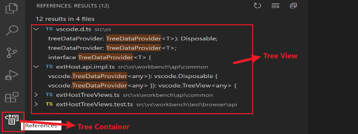

### 视图容器和树视图




### 添加一个树视图的步骤

第一步, 在package.json中添加一个视图。

```json
"contributes": {
    "views": {
        "explorer": [
            {
                "id": "your-view-id",
                "name": "Your View"
            }
        ]
    }
},
```

第二步, 实现`TreeDataProvider`的`getChildren`和`getTreeItem`方法。

```typescript
export class YourProvider implements vscode.TreeDataProvider<Dependency> {
    getTreeItem(element: Dependency) {}
    getChildren(element?: Dependency) {}
}
```

第三步, 将上述数据提供者注册到您的视图中。

```typescript
const rootPath = "project workspace path"
vscode.window.registerTreeDataProvider('your-view-id',  new YourProvider(rootPath));
```

可选的, 添加一个刷新按钮。(需要修改三个文件 `YourTreeProvider`, `extension.ts`, `package.json` )

```typescript
// 提供refresh()方法
private _onDidChangeTreeData: vscode.EventEmitter<Dependency | undefined | null | void> = new vscode.EventEmitter<Dependency | undefined | null | void>();
readonly onDidChangeTreeData: vscode.Event<Dependency | undefined | null | void> = this._onDidChangeTreeData.event;

refresh(): void {
    this._onDidChangeTreeData.fire();
}
```

```typescript
// 注册refresh命令
vscode.commands.registerCommand('yourProvider.refreshEntry', () => yourProvider.refresh());
```

```typescript
// 添加refresh命令
"commands": [
    {
        "command": "your-view-id.refreshEntry",
        "title": "Refresh",
        "icon": {
            "light": "resources/light/refresh.svg",
            "dark": "resources/dark/refresh.svg"
        }
    },
]
// 添加refresh按钮, 并指定refresh命令。
"menus": {
    "view/title": [
        {
            "command": "your-view-id.refreshEntry",
            "when": "view == your-view-id",
            "group": "navigation"
        },
    ]
}
```


### 添加一个视图容器的步骤

第一步, 在package.json中添加一个视图容器。

```json
"contributes": {
  "viewsContainers": {
    "activitybar": [
      {
        "id": "视图容器id",
        "title": "Package Explorer",
        "icon": "media/dep.svg"
      }
    ]
  }
}
```

第二步, 向视图容器添加一个视图。

```json
"contributes": {
    "views": {
        "视图容器id": [
            {
                "id": "视图id",
                "name": "Your View"
            }
        ]
    }
},
```


### 添加视图导航按钮

 

第一步, 在`extension.ts`注册一个refresh命令。

```typescript
vscode.commands.registerCommand('web-component-custom.refresh', () => vscode.window.showInformationMessage(`Successfully refresh.`));
```

第二步, 在`package.json`添加一个refresh命令。

```typescript
"commands": [
    {
        "command": "web-component-custom.refresh",
        "title": "Refresh",
        "icon": {
            "light": "resources/light/refresh.svg",
            "dark": "resources/dark/refresh.svg"
        }
    }
]
```

第三步, 在`package.json`添加一个refresh导航按钮。(group = navagation)

```json
"menus": {
    "view/title": [
        {
            "command": "web-component-custom.refresh",
            "when": "view == 视图id",
            "group": "navigation"
        }
    ]
}
```


### 添加视图下拉选项菜单

 

第一步, 在`extension.ts`注册一个add命令。

```typescript
vscode.commands.registerCommand('web-component-custom.addEntry', () => vscode.window.showInformationMessage(`Successfully called add entry.`));
```

第二步, 在`package.json`添加一个add命令。

```json
"commands": [
    {
        "command": "web-component-custom.addEntry",
        "title": "Add"
    }
]
```

第三步, 在`package.json`添加一个add下拉选项。

```json
"menus": {
    "view/title": [
        {
            "command": "web-component-custom.addEntry",
            "when": "view == 视图id"
        }
    ]
}
```


### 添加TreeItem的行内按钮

 

第一步, 在`extension.ts`注册一个edit命令。

```typescript
vscode.commands.registerCommand('web-component-custom.editEntry', () => vscode.window.showInformationMessage(`Successfully called editEntry.`));
```

第二步, 在`package.json`添加一个edit命令。

```json
"commands": [
    {
        "command": "web-component-custom.editEntry",
        "title": "Edit",
        "icon": {
            "light": "resources/light/edit.svg",
            "dark": "resources/dark/edit.svg"
        }
    }
]
```

第三步, 在`package.json`添加一个edit行内按钮。

```json
"menus": {
    "view/item/context": [
        {
            "command": "web-component-custom.editEntry",
            "when": "view == test2",
            "group": "inline"
        }
    ]
}
```


### 添加TreeItem的右键选项菜单

 

第一步, 在`extension.ts`注册一个delete命令。

```typescript
vscode.commands.registerCommand('web-component-custom.deleteEntry', () => vscode.window.showInformationMessage(`Successfully called delete.`));
```

第二步, 在`package.json`添加一个delete命令。

```json
"commands": [
    {
        "command": "web-component-custom.deleteEntry",
        "title": "Delete"
    }
]
```

第三步, 在`package.json`添加一个delete右键下拉选项。 

```json
"menus": {
    "view/item/context": [
        {
            "command": "web-component-custom.deleteEntry",
            "when": "view == test2"
        }
    ]
}
```


### 欢迎视图

如果您的视图可以为空, 则可以提供`viewsWelcome`欢迎视图。

 

```json
"contributes": {
  "viewsWelcome": [
    {
      "view": "nodeDependencies",
      "contents": "No node dependencies found [learn more](https://www.npmjs.com/).\n[Add Dependency](command:nodeDependencies.addEntry)"
    }
  ]
}
```


### 两种向树视图提供数据的写法

> 直接向视图注入数据

```typescript
export function activate(context: vscode.ExtensionContext) {
    vscode.window.registerTreeDataProvider('视图id', new DepNodeProvider()); // 无返回
}

```

> 创建一个树视图, 并提供数据

```typescript
export function activate(context: vscode.ExtensionContext) {
    new YourView(context);
}
```

```typescript
export class YourView {
    private view: vscode.TreeView<FtpNode>;
	constructor(context: vscode.ExtensionContext) {
        // ↓ see here ↓
		this.view = vscode.window.createTreeView('视图id', { treeDataProvider });
		vscode.commands.registerCommand('视图id.refresh', () => treeDataProvider.refresh());
		vscode.commands.registerCommand('视图id.revealResource', () => this.reveal());
	}
}
```

